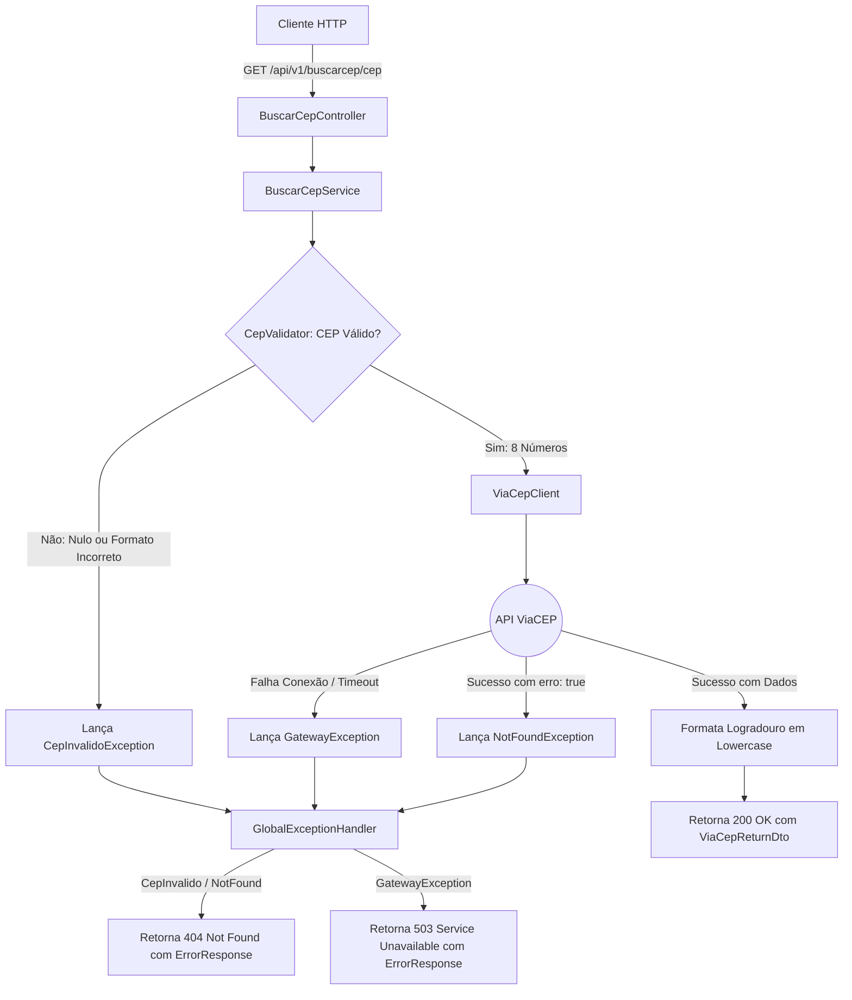

# Gateway ViaCEP Consignado

Serviço REST desenvolvido em Spring Boot 4 para consulta e saneamento de endereços por CEP. A aplicação atua como um intermediário resiliente para a API pública do ViaCEP, aplicando regras de validação de formato, filtragem de campos desnecessários e padronização do contrato de resposta.

## Diagrama de Fluxo



## Funcionalidades e Regras de Negócio

- **Sanitização de Entrada:** Aceita CEPs formatados (ex: `01001-000`) ou numéricos (ex: `01001000`), removendo automaticamente caracteres não dígitos.
- **Filtro de Atributos:** Retorna apenas as informações essenciais (`cep`, `logradouro`, `complemento`, `bairro`, `localidade`), descartando metadados como IBGE, DDD e SIAFI.
- **Padronização de Texto:** Garante que o texto do logradouro seja convertido para minúsculas antes do retorno ao cliente.
- **Tratamento de Exceções:** Captura e mapeamento centralizado de erros via `@RestControllerAdvice`:
  - CEPs inválidos ou não encontrados no ViaCEP retornam `404 Not Found`.
  - Indisponibilidades ou timeouts na comunicação externa retornam `503 Service Unavailable`.

## Arquitetura e Testes

A aplicação utiliza arquitetura em camadas (Controller, Service, Domain e Client), garantindo baixo acoplamento e separação clara de responsabilidades.

A suíte de testes automatizados contempla:
- **Testes Unitários:** Validação das regras de validação no `CepValidator` e mocks de serviço no `BuscarCepService`.
- **Testes de Controller:** Teste das rotas e contratos HTTP através de `@WebMvcTest` e `MockMvc`.
- **Testes de Infraestrutura:** Teste do consumo do `RestClient` com `MockRestServiceServer`, simulando diferentes cenários de resposta da rede em isolamento.

## Tecnologias

- **Java 17**
- **Spring Boot 4.0.7** (Spring Web MVC & RestClient)
- **Springdoc OpenAPI** (Swagger UI)
- **JUnit 5 & Mockito**

## Como Executar

### Rodar a aplicação
```bash
./mvnw spring-boot:run
```
A API estará disponível em `http://localhost:8080`.
A documentação Swagger pode ser acessada em `http://localhost:8080/documentacao`.

### Executar com Docker (VPS / Produção)

Configurei a aplicação para rodar por padrão na porta **`8088`** (para evitar conflitos com a porta `8080`).

Usando **Docker Compose**:
```bash
docker compose up -d
```

Ou usando o comando **Docker** diretamente:
```bash
docker build -t gateway-viacep .
docker run -d -p 8088:8088 --name gateway-viacep gateway-viacep
```

> **Dica de Porta:** Caso a porta `8088` também já esteja em uso na sua VPS, você pode mapear para qualquer outra porta externa (ex: `9090`):
> ```bash
> docker run -d -p 9090:8088 --name gateway-viacep gateway-viacep
> ```

### Executar os testes
```bash
./mvnw test
```

## Exemplo de Uso

### Requisição
```http
GET /api/v1/buscarcep/01001-000
```

### Resposta (200 OK)
```json
{
  "cep": "01001-000",
  "logradouro": "praça da sé",
  "complemento": "lado ímpar",
  "bairro": "Sé",
  "localidade": "São Paulo"
}
```
